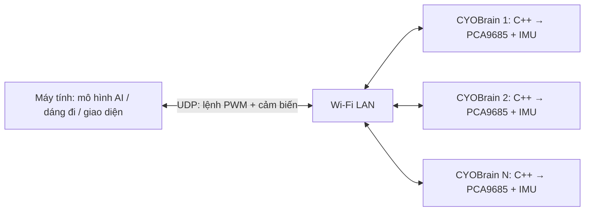

> Archived documentation. For current setup and private Wi-Fi configuration, see [SETUP.md](../../docs/SETUP.md). Local recovery backups and reports mentioned below are not included in Git.

# CYOBot: phần cứng trên robot, điều khiển trên máy tính

Firmware C++ cho CYOBrain ESP32-S3 nhận 16 giá trị PWM, màu RGB của ma trận/vòng LED và trả IMU, điện áp pin, hai nút bấm. Python trên máy tính thực hiện hiệu chỉnh khớp, nội suy, dáng đi, test servo, xử lý giao diện LED và gọi mô hình AI. Không cần cài thư viện Python cho giao tiếp UDP.

Xem [kết quả kiểm chứng và đo tốc độ trên mạch thật](VALIDATION.md).



## Cách hoạt động

- Nhận lệnh qua UDP port **4242**, một gói 48 byte cho toàn bộ 16 kênh. Gói mới nhất trong một lượt nhận được áp dụng; gói trùng hoặc ngược thứ tự bị loại bỏ.
- Ghi 64 byte thanh ghi PWM trong một giao dịch I²C 400 kHz. PCA9685 chốt các kênh ở cùng điều kiện STOP.
- Mặc định máy tính gửi 100 lệnh/giây. Mạch trả trạng thái mục tiêu 100 lần/giây và đọc IMU mục tiêu 200 lần/giây; LSM6DSL cấu hình ODR 416 Hz, ±4 g, ±500°/s. Đây là các nhịp đặt lịch, không phải bảo đảm thời gian thực.
- Giữ nguyên prescaler **112**, khoảng **120–600 ticks** từ chương trình servo cũ; 0 nghĩa là ngắt xung kênh đó. Tần số PWM danh định khoảng 54 Hz với oscillator 25 MHz. Gửi 200 lệnh/giây không đồng nghĩa servo cơ khí chuyển động 200 lần/giây.
- Khi không có lệnh hợp lệ trong **1.000 ms**, hoặc Wi-Fi mất kết nối, mạch **giữ nguyên PWM cuối cùng**, đồng thời kết thúc phiên điều khiển. Thời hạn phiên chịu được các đợt mất gói Wi-Fi ngắn; Studio giữ góc khi phản hồi hoặc xác nhận PWM chậm quá **100 ms**. Việc kết nối trở lại không tự tiếp tục dáng đi.
- Lệnh `off` mới ngắt toàn bộ xung. Khởi động/reset MCU bắt đầu với các servo tắt; chính sách giữ góc áp dụng cho mất liên lạc khi mạch còn chạy. I²C lỗi được chốt thành fault và yêu cầu kiểm tra/khởi động lại.
- MAC nhận diện từng robot. Mỗi robot chỉ chấp nhận một phiên điều khiển từ một IP/port; boot ID, challenge thay đổi khi hết phiên và số thứ tự giúp loại bỏ các gói của phiên cũ. Đây là kiểm soát phiên trên LAN tin cậy, không phải xác thực mật mã.

`ticks` và `commanded_angles_deg` là **giá trị đã ra lệnh**, không phải góc đo từ servo. Servo hiện tại không cung cấp phản hồi góc cho mạch. Điện áp pin dùng ADC GPIO6, hệ số cầu chia 4; chưa hiệu chuẩn bằng đồng hồ, chưa chuyển thành phần trăm pin.

Firmware này thay ứng dụng MicroPython/Portal đang chạy. Website cũ và chức năng giữ hai nút để quét servo không chạy trong firmware C++; nút bấm được báo về máy tính để chương trình máy tính quyết định hành vi. Mã và dữ liệu cũ trên thẻ SD được giữ để khôi phục. Wi-Fi STA mặc định vẫn lấy từ `../MicroPython/sd/config/robot-config.json`; firmware này không phát AP và không chạy web server/WebREPL.

## Dùng trên máy tính

### Giao diện CYOBot Studio

Nhấp đúp `host/start_studio.cmd`, hoặc chạy:

```powershell
python host/studio.py --open
```

Ứng dụng mở tại **http://127.0.0.1:8765**. Chọn robot bên trái rồi nhấn **Kết nối mạch**. Lần đầu kết nối giữ nguyên PWM đã đọc. Mô hình crawler 3D hỗ trợ kéo xoay, cuộn zoom, góc nhìn từ trên, chụp PNG và chọn trực tiếp từng khớp. Các khớp dùng cấu hình Crawler hiện tại: `[4,5,6,7,11,10,0,1]`; bảng 16 kênh cho phép chọn các servo còn lại.

Giao diện có ba không gian chung: **Đội robot** quét mạng, thêm IP và mở robot; **Robot** giữ mô hình 3D ở giữa với bảng Servo / IMU / LED / Âm thanh / Thẻ nhớ bên cạnh; **Bộ não AI** hiển thị nguồn dữ liệu và trạng thái phần cứng thật, xuất mẫu telemetry JSON, mở hướng dẫn tích hợp SDK. Không gian AI chưa nạp hay chạy mô hình; Studio vẫn điều khiển thủ công một robot mỗi phiên. Bấm biểu tượng phần cứng trong trang AI sẽ mở đúng công cụ của robot, không tự gửi lệnh chuyển động.

Trạng thái kết nối, nút **Giữ** và **Tắt xung** luôn có trên thanh phiên ở cả ba không gian. Rời màn hình Robot dừng test/dáng đi ở góc cuối; trở lại không tự chạy tiếp. Luồng mic vẫn tiếp tục khi đổi không gian, nhưng dừng khi ẩn trang. Màn hình hẹp đặt bảng công cụ dưới 3D; không phủ lên mô hình. Tab công cụ hỗ trợ phím trái/phải, Home/End. Bố cục và thành phần dùng chung nằm trong `host/ui/shell.css`; điều hướng và trạng thái trình bày nằm trong `host/ui/workspace.js`; stylesheet tính năng chỉ định dạng nội dung bên trong bảng.

- **Khớp:** chọn chân/hông, dùng thanh trượt hoặc nút ±5°. Góc trên thanh trượt là góc servo vật lý tương đối với điểm giữa, từ −90° đến +90°. **Về giữa** áp dụng góc logic 0 cho tám khớp theo offset/chiều quay trong cấu hình.
- **Test servo:** chọn một kênh, biên độ mặc định ±10°, chu kỳ 1/2/4 giây, rồi nhấn **Chạy test**. Test quanh góc đặt hiện tại và bị từ chối nếu vượt ±90°. **Giữ** dừng tại góc cuối; đổi kênh/chế độ cũng dừng test.
- **Di chuyển:** giữ nút hướng để chạy dáng đi; thả nút để giữ tư thế. Tốc độ và nội suy được tính trên máy tính.
- **Cảm biến:** điện áp pin, RTT, trạng thái hai nút, đồ thị gia tốc/gyro và độ nghiêng từ trọng lực IMU. Điện áp chưa được hiệu chuẩn thành phần trăm pin.
- **LED:** mở tab LED trong bảng công cụ. Chạm/kéo từng điểm để vẽ, chọn màu/bút xóa, độ sáng; chọn Ma trận / Vòng / Cả hai để tô hoặc tắt cụm. Có mẫu trái tim, mặt cười và cầu vồng. Mặc định độ sáng 20%; Xem trước chỉ vẽ trên PC. Trạng thái “Đã xác nhận từ mạch” là phản hồi firmware sau lệnh xuất màu, không phải đo ánh sáng bằng cảm biến. Tắt LED riêng không đổi PWM servo; Tắt xung/ESC chỉ tắt servo.
- **Xem trước:** thử góc, test và dáng đi trên mô hình mà không gửi lệnh đến mạch. Bật xem trước ngắt phiên điều khiển hiện tại.
- **SPACE:** giữ góc. **ESC / Tắt xung:** ngắt toàn bộ PWM và chờ xác nhận từ mạch. Ẩn trang hoặc mất heartbeat giao diện trên 0,8 giây dừng chuyển động nhưng vẫn giữ kết nối để theo dõi. Đóng trang/ngắt kết nối chủ động kết thúc phiên.
- Nếu mất phiên do đường truyền, Studio tự tìm/chiếm quyền lại đúng MAC và đọc PWM đang giữ trên mạch. Test servo, dáng đi, mục tiêu chưa đạt và lệnh LED đang chờ đều không được tiếp tục tự động; cần ra lệnh mới. Lỗi phần cứng không tự chiếm lại phiên. UI báo “Đang nối lại…” hoặc “Chờ phản hồi · giữ góc”.
- Cửa sổ đang hoạt động giữ quyền điều khiển. Nếu cửa sổ cũ đã mất heartbeat quá 0,8 giây, người dùng có thể bấm Kết nối trong cửa sổ mới để nhận quyền, bắt đầu ở trạng thái giữ góc.

Studio dùng lại mô hình crawler lắp ráp gốc từ Blender ngày 27/09/2026: URDF, 115 mesh hiển thị, tám khớp servo và các khớp phụ của cơ cấu bốn thanh. Bộ mesh và URDF nằm trong `host/ui/robot/`; nguồn và hash đối chiếu được ghi trong `host/ui/robot/README.md` và `manifest.json`. Hình 3D hiển thị **góc đã ra lệnh**, không phải góc servo đo được hay mô phỏng động lực học. Giới hạn khớp trong URDF được giữ làm metadata; hình 3D hiển thị đầy đủ góc ra lệnh, không phát hiện va chạm cơ khí. Khi tắt xung, mô hình giữ góc đặt cuối đã quan sát trong cửa sổ đó; vị trí servo thực khi không có xung không được đo. Độ nghiêng chỉ là ước lượng từ gia tốc, không có heading/yaw tuyệt đối.

Server chạy cục bộ, một luồng UDP riêng đặt lịch 100 Hz; xoay mô hình không chặn vòng gửi lệnh. Three.js r170 và font được lưu sẵn trong `host/ui/`, không cần Internet/CDN, npm hay thư viện Python bổ sung. Studio điều khiển thủ công **một robot tại một thời điểm**; SDK/policy bên dưới dùng cho điều khiển nhiều robot và AI. Một cửa sổ giữ quyền điều khiển để tránh xung đột. Nút **+** hỗ trợ thêm IP nếu DHCP thay đổi hoặc broadcast không tìm thấy mạch.

### CLI và SDK

Chạy từ thư mục `software/HardwareBridge`. Máy tính và robot cùng Wi-Fi. Ví dụ với IP đã dùng trước đây (có thể thay đổi theo DHCP):

```powershell
python host/cli.py discover
python host/cli.py discover --ip 192.168.1.8
python host/cli.py discover --ip 192.168.1.255
python host/cli.py monitor --ip 192.168.1.8 --seconds 10
python host/cli.py benchmark --ip 192.168.1.8 --hz 100 --seconds 10 --report reports/100hz.json
```

Monitor/benchmark giữ nguyên các giá trị PWM đã đọc khi bắt đầu, không yêu cầu đổi góc. Chúng chiếm phiên điều khiển nên không chạy đồng thời với một chương trình điều khiển khác. Discovery không chiếm quyền.

Nếu broadcast mặc định không tìm thấy robot trên máy có nhiều card mạng, dùng IP trực tiếp hoặc broadcast của đúng subnet, như `192.168.1.255` cho mạng `192.168.1.0/24`.

Các lệnh bên dưới thực sự điều khiển servo:

```powershell
# Chạy dáng đi gốc trên PC; các điểm và nội suy đều ở host/gait.py
python host/cli.py walk --ip 192.168.1.8 --config ../MicroPython/sd/config/robot-config.json --motion forward --seconds 5 --cycle 1

# Đưa tám khớp về góc logic 0, có áp dụng chiều quay và offset
python host/cli.py pose --ip 192.168.1.8 --config ../MicroPython/sd/config/robot-config.json --angles 0 0 0 0 0 0 0 0 --seconds 2

# Test một kênh, +/-10 độ quanh giữa; tín hiệu do máy tính tạo
python host/cli.py servo-test --ip 192.168.1.8 --channel 4 --amplitude 10 --seconds 5

# Ngắt toàn bộ xung, chờ xác nhận từ mạch
python host/cli.py off --ip 192.168.1.8
```

Hết thời gian hoặc Ctrl+C sẽ giữ tư thế cuối. Lặp `--ip` để điều khiển nhiều robot; các robot khác nhau cần cấu hình hiệu chỉnh riêng khi tích hợp AI. CLI walk/pose dùng chung một file hiệu chỉnh cho tất cả robot được chọn, phù hợp khi chúng đã được hiệu chỉnh giống nhau.

## Kết nối mô hình AI

`host/run_policy.py` tải một file Python có hàm `predict(observations)`. Đầu vào là dictionary theo MAC, mỗi robot có `gyro_dps`, `accel_g`, `battery_v`, `buttons`, `commanded_angles_deg`, `imu_us`, `uptime_us`, `host_age_s` và trạng thái giao tiếp. Đầu ra là dictionary `{MAC: [8 góc logic tính bằng độ]}`, theo thứ tự leg0 upper/lower, leg1 upper/lower, leg2 upper/lower, leg3 upper/lower.

Một ví dụ kiểm tra tích hợp chỉ giữ tư thế hiện tại:

```python
def predict(observations):
    return {mac: state["commanded_angles_deg"]
            for mac, state in observations.items()}
```

Với servo đang tắt, ví dụ trên sẽ ra lệnh góc giữa, do không có góc đo thực tế. Để quan sát mà không phát sinh chuyển động, dùng `monitor`.

```powershell
python host/run_policy.py --policy my_policy.py --ip 192.168.1.8 --robot 3c:84:27:f3:d0:5c=../MicroPython/sd/config/robot-config.json --hz 100
```

Huấn luyện và runtime mô hình nằm bên ngoài firmware. Trong `predict`, gom dữ liệu các robot thành một batch để suy luận trên CPU/GPU, rồi ánh xạ đầu ra về MAC tương ứng. Không có mô hình đã huấn luyện được thêm vào dự án này. SDK dừng gửi nếu suy luận hoặc phản hồi/xác nhận lệnh chậm quá 250 ms; firmware kết thúc phiên sau 1.000 ms không nhận lệnh. SDK AI không tự chiếm quyền lại và không phát lại action khi mô hình ngừng tạo action.

Thư viện `Fleet` dùng một socket không chặn, gửi lệnh tới tất cả robot trước khi chờ nhịp kế tiếp. Độ tuổi telemetry được kiểm tra, nhưng chưa đồng bộ đồng hồ giữa robot và máy tính. Không bảo đảm nhiều robot chốt lệnh cùng microsecond. Khả năng chạy hàng chục robot cần được đo trên số robot và AP thực tế; kiểm thử định tuyến 30 robot trên PC không thay thế thử nghiệm Wi-Fi với 30 robot thật.

## Build, nạp, khôi phục

### LED và giao thức mở rộng

Ma trận WS2812B-2020: GPIO15, 33 LED, các hàng trái → phải `[0..4]`, `[5..11]`, `[12..20]`, `[21..27]`, `[28..32]`, căn giữa; nhìn từ mặt LED với RESET phía trên, USB phía dưới. Vòng: GPIO7, 12 LED; số 0 phía trên và tăng theo chiều kim đồng hồ khi nhìn từ mặt LED. Đối chiếu `MicroPython/sd/lib/display.py` và bản PCB mặt trên ở trang 6 của hai PDF trong `hardware/electronics/schematics/`.

Firmware dùng Adafruit NeoPixel 1.15.5 (RMT trên ESP32), GRB/800 kHz trên chân tín hiệu; giao thức UDP dùng RGB để SDK/UI không phải đổi thứ tự màu. `LED_READY=64` trong INFO/STATUS quảng bá khả năng; firmware cũ vẫn giao tiếp PWM nhưng Studio khóa điều khiển LED và báo cần cập nhật.

- `LED_FRAME=8`: payload 135 byte RGB, gồm 33 pixel ma trận rồi 12 pixel vòng; header/session giữ định dạng v1. Không chứa PWM và không chạy hiệu ứng tự động trên mạch.
- `LED_STATUS=9`: payload 139 byte, `applied_seq` uint32 little-endian rồi 135 byte màu đã xuất. Phản hồi lúc CLAIM, sau ghi màu và định kỳ 100 ms khi đang có phiên. STATUS servo cũ vẫn 80 byte.
- Luồng LED và luồng PWM kiểm tra số thứ tự riêng trong cùng phiên để gói UDP của hai luồng không loại bỏ lẫn nhau; cả hai đều kiểm tra chủ sở hữu và phiên. Tắt hoặc hết phiên giữ màu LED cuối; khởi động mạch tắt cả hai cụm.
- SDK: `Fleet.send_leds(robot, matrix, ring)` nhận 33 và 12 bộ RGB nguyên 0..255, không chặn để chờ ACK; dùng `Fleet.poll()` và `robot.leds` để đọc xác nhận. Studio gửi lại tối đa 6 lần cách nhau 80 ms nếu chưa nhận màu mong muốn. Khi mất kết nối, hủy lệnh LED đang chờ; sau khi nối lại chỉ đọc màu đang giữ, không phát lại bản chỉnh sửa cũ.

Phép thử trực tiếp ở độ sáng thấp, yêu cầu tất cả servo đang tắt:

```powershell
python tools/smoke_leds.py --ip 192.168.1.8
```

### Firmware

```powershell
python -m platformio run
python -m platformio run --target upload --upload-port COM6
python -B -m unittest discover -s tests -v
```

PlatformIO được pin ở espressif32 6.12.0 / Arduino ESP32 2.0.17. Script build đọc Wi-Fi từ cấu hình hiện có và tạo `include/wifi_config.h` (đã gitignore). Không in mật khẩu ra console. Khi đổi Wi-Fi phải build/nạp lại phiên bản này.

Snapshot đầy đủ trước lần chuyển sang C++ ngày 2026-10-07:

`C:\Users\manhpc\.codex\backups\CYOBot-v2\20261007-3c8427f3d05c\flash-before-hardware-bridge.bin`

Kích thước 8,388,608 byte, SHA256 `668e327a7c4d6735ae5fe24aec01c0f0ecc25a96f04ba09fe3059fe0636aa124`.

Khôi phục snapshot sẽ đưa lại MicroPython, Portal, chế độ test bằng hai nút và Wi-Fi đã cấu hình:

```powershell
python -m esptool --chip esp32s3 --port COM6 --baud 460800 write-flash 0 "C:\Users\manhpc\.codex\backups\CYOBot-v2\20261007-3c8427f3d05c\flash-before-hardware-bridge.bin"
```

## Giao thức

Các trường số nguyên đều little-endian. Header `4s BB H II` = magic `CYO2`, version 1, type, độ dài payload, session, sequence. Bố cục chuẩn nằm trong `include/protocol.h` và `host/cyobot.py`.

| Type | Payload | Mục đích |
|---|---|---|
| 1 DISCOVER | rỗng, session=0 | Unicast hoặc broadcast; sequence được echo |
| 2 INFO | MAC 6 byte, boot u32, challenge u32, flags/port/prescale/min/max/lease_ms 6×u16 | Danh tính và giới hạn |
| 3 CLAIM | boot u32, challenge u32 | Session ngẫu nhiên khác 0 từ host; trả STATUS |
| 4 FRAME | 16×u16 | 0=off, 120..600 PWM ticks; làm mới lease |
| 5 RELEASE | rỗng | Giữ góc, kết thúc phiên |
| 6 OFF | rỗng | Tắt xung, kết thúc phiên, trả STATUS; có thể gửi lại để nhận ACK |
| 7 STATUS | 80 byte | uptime/accepted_seq/applied_seq/received/applied/rejected 6×u32; flags/buttons/battery_mV/apply_us 4×u16; imu_us u32; gx/gy/gz/ax/ay/az 6×i16; commanded ticks 16×u16 |
| 8 LED_FRAME | 135 byte RGB | Ma trận 33 pixel, vòng 12 pixel; làm mới lease |
| 9 LED_STATUS | u32 applied_seq + 135 byte RGB | Xác nhận riêng của luồng LED |
| 10 DIAG_QUERY | rỗng, session=0 | Đọc chẩn đoán; không gia hạn phiên, không thay đổi PWM/LED |
| 11 DIAGNOSTICS | 10×u32 + i16 RSSI + u16 reason | boot, uptime_ms, session, command_age_ms, received, rejected, max_loop_us, wifi_losses, lease_expirations, send_errors; reason 0=chưa ngắt, 1=hết hạn, 2=Wi-Fi, 3=RELEASE, 4=OFF, 5=I²C |

Flags: OWNED=1, HOLDING=2, PWM_OK=4, IMU_OK=8, FAULT=16, WIFI_OK=32, LED_READY=64, SD_READY=128, AUDIO_READY=256, MEDIA_READY=512. `IMU_OK=0` nghĩa dữ liệu IMU chưa có/đã cũ do lỗi đọc. Gyro raw × 0.0175 = °/s; accel raw × 0.000122 = g. Các timestamp microsecond 32 bit tự quay vòng sau khoảng 71.6 phút; sequence cũng dùng so sánh modulo 32 bit.

Studio ghi 15 giây lịch sử trước mỗi lần mất phiên vào `reports/studio-connection-events.jsonl`, gồm nhịp gửi, tuổi telemetry/heartbeat, bộ đếm và chẩn đoán firmware. `Fleet.query_diagnostics(robot)` đọc các bộ đếm mà không chiếm quyền/gia hạn phiên, kể cả sau khi phiên hết hạn. Gói DIAGNOSTICS không được coi là phản hồi PWM hay dữ liệu đầu vào mới cho AI.

IMU trả dữ liệu đã đổi đơn vị, chưa bù bias hay tính orientation. Những phép xử lý này thuộc chương trình trên máy tính. `run_policy.py` dừng gửi lệnh nếu IMU báo lỗi hoặc timestamp mẫu cũ quá 50 ms.

RTT trong benchmark là thời gian từ host gửi lệnh tới host nhận telemetry xác nhận **applied_seq** tương ứng; bao gồm lịch trả telemetry, không phải độ trễ một chiều hay thời gian chuyển động cơ khí. Các gói bị thay thế trong lượt nhận không có mẫu RTT riêng. `apply_us` chỉ đo lượt ghi I²C cuối cùng.

`received` đếm frame hợp lệ nhận được; `applied` đếm frame thực sự ghi tới PCA9685. Chênh lệch gồm các frame được gộp để ưu tiên frame mới nhất. Benchmark dùng `perf_counter` có độ phân giải cao trên Windows và chờ phản hồi cuối trước khi chốt số liệu.

Thiết kế thanh ghi được đối chiếu với [datasheet PCA9685](https://www.nxp.com/docs/en/data-sheet/PCA9685.pdf) và [datasheet LSM6DSL](https://www.st.com/resource/en/datasheet/lsm6dsl.pdf). Chân SDA17/SCL18, nút4/38 và ADC6 lấy từ variant CYOBrain trong dự án.


## Thẻ nhớ và âm thanh — 2026-10-09

Trong Studio, kết nối mạch rồi mở **Âm thanh** hoặc **Thẻ nhớ** trên thanh trên cùng. Trên khung hẹp, thanh này hiển thị biểu tượng.

- **Nghe robot**: nghe hai mic trên mạch qua loa/tai nghe máy tính; hai thanh mức hiển thị RMS theo dBFS.
- **Nói với robot**: trình duyệt hỏi quyền mic máy tính, sau đó truyền sang loa robot. Chỉ mở mic PC khi người dùng bấm nút. Bấm lại để kết thúc nói.
- **Phát file**: chọn WAV/MP3 hoặc định dạng trình duyệt giải mã được; PC chuyển về PCM mono 16 kHz rồi phát trên mạch. File âm thanh tối đa 32 MiB. **Dừng** đóng luồng và bỏ dữ liệu đang chờ. Chuyển tab trình duyệt ra nền hoặc mất phiên cũng dừng âm thanh; không tự bật lại mic/loa.
- **Thẻ nhớ**: duyệt thư mục, tải lên/xuống, tạo thư mục, đổi tên/di chuyển. Tải lên không ghi đè file có sẵn. Upload ghi file tạm rồi rename khi nhận đủ. Giao diện giới hạn tải mỗi file 32 MiB; SDK tải xuống theo chunk nên hỗ trợ file lớn hơn.
- Nút ⌫ chuyển vào `/.cyobot-trash`; mở thùng rác, bấm đổi tên và nhập đường dẫn đích để khôi phục. Không có thao tác xóa vĩnh viễn hoặc format. **Đọc lại thẻ** mount lại sau khi cắm thẻ FAT32. Mạch hiện chưa có thẻ, vì vậy danh sách chưa thể thử trên thẻ thật.

### Phần cứng và luồng truyền

Pin dưới đây là **GPIO ESP32-S3**, được đối chiếu schematic, không phải số chân vật lý của module:

| Bộ phận | GPIO / chip |
|---|---|
| microSD SPI | SCK 12, MISO 13, MOSI 11, CS 14; 4 MHz |
| I2S duplex | MCLK 16, BCLK 9, WS 45, TX 8, RX 10 |
| Amplifier | Enable GPIO 47; chỉ bật khi nhận PCM loa mới và âm lượng > 0 |
| Loa | ES8311, I²C 0x18 hoặc 0x19; DAC -6 dB, volume phần mềm 0–100% |
| Hai mic | ES7210, I²C 0x40, MIC1/MIC2, gain 24 dB sau enable |

Driver codec lấy từ [Espressif ESP-ADF v2.7](https://github.com/espressif/esp-adf/tree/v2.7/components/esp_codec_dev), Apache-2.0, lưu trong `lib/esp_codec_dev`. `SOURCE.json` ghi commit/tree và SHA-256 từng file nguồn. ArduinoJson 6.21.5 được pin trong PlatformIO.

PWM/LED/IMU vẫn dùng UDP 4242. Thẻ dùng TCP 4243, PCM duplex dùng TCP 4244, hai task FreeRTOS riêng trên core 0; vòng servo không chờ FAT, audio hoặc trình duyệt. Tất cả luồng media kiểm tra session hiện tại và IP của chủ điều khiển. Media không gia hạn lease: PC vẫn phải giữ vòng Fleet/Studio chạy. TCP media chưa mã hóa; dùng mạng Wi-Fi tin cậy.

Thẻ nhận một JSON kết thúc newline gồm `session`, `op` (`info`, `mount`, `list`, `upload`, `download`, `mkdir`, `rename`, `trash`), `path` và các trường tương ứng. Upload: ACK JSON, đúng `size` byte raw, ACK cuối. Download: JSON `size`, rồi dữ liệu raw. List có phân trang `offset` / `next`, tối đa 64 mục và giới hạn bộ nhớ JSON. Đường dẫn tuyệt đối UTF-8 tối đa 220 byte; cấm traversal, ký tự điều khiển, backslash, ghi đè đích. Tháo thẻ khi đang truyền có thể làm thao tác thất bại; app hiển thị lỗi và cho đọc lại thẻ.

Audio handshake JSON `{session,op:"start"}` trả `sample_rate:16000`, `mic_channels:2`, `speaker_channels:1`, `block_samples:320`, `format:"s16le"`. Mỗi frame có header little-endian `<BBHI>`: type, channels, byte count, sequence u32. Type 1 = mic stereo, 1.280 byte; type 2 = loa mono, 640 byte; type 4 = volume, 1 byte. Một block dài 20 ms. Firmware hoàn tất TCP write bị chia nhỏ với tối đa một frame chờ; không tích lũy audio cũ khi mạng chậm. SDK có hàng đợi loa 120 ms, bỏ block quá 200 ms, hàng đợi mic 240 ms và đóng luồng khi không có consumer/producer trong 3 giây. Trên Windows, SDK yêu cầu timer 1 ms trong thời gian chạy audio và trả lại khi đóng luồng để tránh nhịp 20 ms trôi thành khoảng 31 ms.

### Dùng với bộ não AI trên PC

`host/media.py` không phụ thuộc thư viện ngoài. Tạo `RobotMedia(robot)` sau khi robot đã được `Fleet.claim()`; vòng điều khiển Fleet vẫn chạy, xử lý media/inference trong worker riêng. Ví dụ các lời gọi ở worker:

```python
from media import RobotMedia

media = RobotMedia(robot)       # robot thuộc phiên Fleet hiện tại
stream = media.start_audio()
stream.set_volume(20)
mic_stereo = stream.read_pcm(timeout=0.04)  # 320 mẫu × 2 kênh, signed PCM16 LE
# Đưa mic_stereo vào ASR/AI trên máy tính.
# TTS trên PC tạo PCM mono 16 kHz; gửi từng block 640 byte, nhịp 20 ms:
stream.write_pcm(pcm_mono_640_bytes)

entries = media.files('/')
with open('voice.wav', 'rb') as source:
    media.upload('/voice.wav', source, size_in_bytes)
with open('copy.wav', 'wb') as target:
    media.download('/voice.wav', target)
media.stop_audio()
media.close()
```

Không chạy ASR/TTS hoặc truyền file trong callback điều khiển servo. Mỗi robot có RobotMedia riêng, gắn với phiên của robot đó. Thay phiên phải đóng media cũ và mở chủ động lại. Cơ sở nhận/gửi PCM và file đã có; chưa gắn mô hình AI, ASR, TTS hay xử lý khử vọng âm trên PC. Thử nghiệm hiện tại dùng một mạch; chưa đo tải hàng chục robot đồng thời.

Các API localhost tương ứng: `GET /api/media/info`, `/files?path=&offset=`, `/download?path=`, `/mic`; `POST /api/media/action` (JSON), `/upload?path=` (binary), `/pcm` (binary). GET/binary yêu cầu `X-CYO-Token`, `X-CYO-Client`, `X-CYO-Session`; JSON action chứa `client`, `control_session` và token header. Chỉ cửa sổ đang sở hữu robot được truy cập media.

Kiểm tra không dùng phần cứng: `python -B -m unittest discover -s tests -v` và `node tests/test_audio_worklet.cjs`, `node tests/test_workspace.cjs`. Fixture `python tests/serve_media_fixture.py` chỉ dùng robot/thẻ RAM tại port 8766, không nối mạch thật. Kiểm tra mạch thực: `python tools/smoke_media.py --seconds 30`; thêm `--tone` để phát tone nhỏ 1 giây. Script từ chối mạch đang có người điều khiển hoặc có servo bật.
